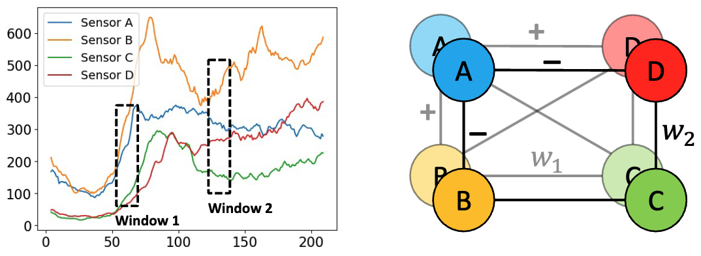
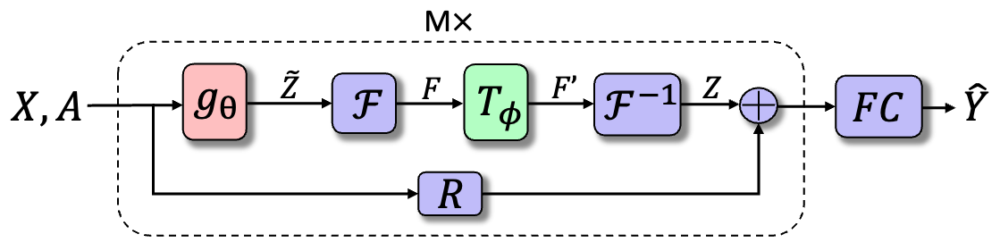

<div align="center">
  <!-- <h1><b> Time-LLM </b></h1> -->
  <!-- <h2><b> Time-LLM </b></h2> -->
  <h2><b> Towards Expressive Spectral-Temporal Graph Neural Networks for Time Series Forecasting </b></h2>
</div>

<div align="center">
**[<a href="https://arxiv.org/pdf/2305.06587">Paper Page</a>]**
</div>

---
>
> 🙋 Please let us know if you find out a mistake or have any suggestions!
> 
> 🌟 If you find this resource helpful, please consider to star this repository and cite our research:

```
@article{jin2025expressive,
  title={Towards Expressive Spectral-Temporal Graph Neural Networks for Time Series Forecasting},
  author={Ming Jin and Guangsi Shi and Yuan-Fang Li and Bo Xiong and Tian Zhou and Flora D. Salim and Liang Zhao and Lingfei Wu and Qingsong Wen and Shirui Pan},
  journal={IEEE Transactions on Pattern Analysis and Machine Intelligence},
  year={2023}
}
}
```

## Introduction
Existing message-passing-based spatio-temporal GNNs (MP-STGNNS) often struggle with capturing complex, dynamic relationships in 
time series data, and their limitations stem from a lack of expressiveness, which we define as the ability of a model 
to accurately represent a wide range of temporal and spatial dependencies within the data.

<p align="center">

</p>

Spectral-temporal GNNs, as an advanced abstraction of MP-STGNNS, shed light on modeling differently signed time series 
correlations by approximating graph convolutions with a broad range of graph spectral filters beyond low-pass filtering.

<p align="center">

</p>

In this research, we establish a framework that unravels the expressive power of spectral-temporal GNNs. 
To make our findings useful in practice on valid instantiations, we discuss related constraints in detail and outline 
a theoretical blueprint for designing spatial and temporal modules in spectral domains. 

Building on these insights and to demonstrate how powerful spectral-temporal GNNs are based on our framework,
we propose a simple instantiation named Temporal Graph Gegenbauer Convolution (TGGC), which significantly outperforms most
existing models with only linear components and shows better model efficiency.

## Requirements

- numpy==1.23.3
- pandas==1.4.4
- torch==1.13.0

To install all dependencies:
```
pip install -r requirements.txt
```

## Example Datasets

Four traffic benchmarks are included under the path of `./dataset`

## Quick Demos

Enter the directory with training scripts

```cd scripts/```

To train on the PeMS03 dastaset:
- ```bash pems03.sh```
- Example output: ```./output/pems03.log```

To train on the PeMS04 dastaset:
- ```bash pems04.sh```
- Example output: ```./output/pems04.log```

To train on the PeMS07 dastaset:
- ```bash pems07.sh```
- Example output: ```./output/pems07.log```

To train on the PeMS08 dastaset:
- ```bash pems08.sh```
- Example output: ```./output/pems08.log```

## Detailed usage
Please refer to the function ```get_args()``` in ```main.py``` for the description of each hyperparameter.

## Acknowledgement
Our implementation adapts [StemGNN](https://github.com/microsoft/StemGNN) and 
[MTGODE](https://github.com/TrustAGI-Lab/MTGODE) as the code base and have extensively modified 
it to our purposes. We thank the authors for sharing their implementations and related resources.